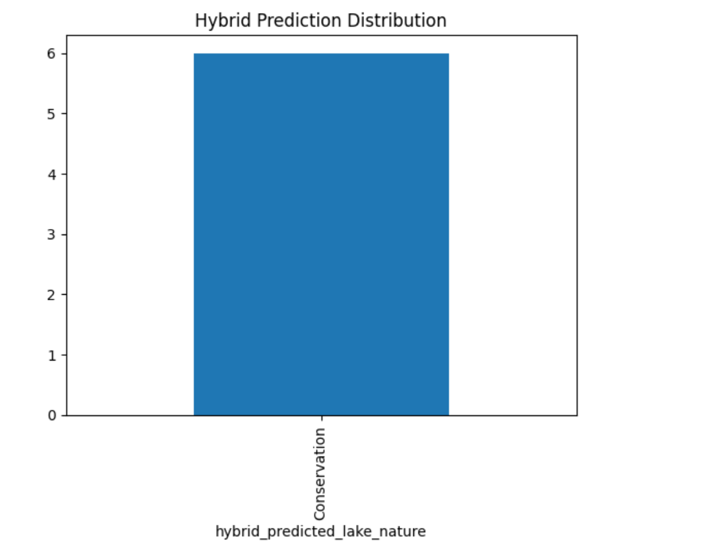

🐟 Lake Fishing Prediction System
Hybrid AIS + CSA Optimized Machine Learning Model
📌 Project Overview

Fishing activities in lakes are highly regulated to protect ecosystems, ensure sustainability, and support fisheries and tourism. These regulations vary by season, conservation status, and restrictions, making manual interpretation difficult.

This project builds an AI-driven decision-support system that:

Predicts the nature of a lake (Open / Seasonal / Restricted / Conservation)

Determines fishing allowance

Uses a Hybrid Artificial Immune System (AIS) + Crow Search Algorithm (CSA) for intelligent optimization

Generates visual analytics, prediction files, and trained models

🎯 Objectives

Automatically analyze lake fishing regulation datasets

Derive lake nature using regulation semantics

Optimize feature selection and model parameters using bio-inspired algorithms

Generate clear visual outputs and machine-readable predictions

🧠 Methodology
🔬 Hybrid Optimization Strategy
Stage	Algorithm	Purpose
1	AIS (Artificial Immune System)	Feature selection (select most informative regulation fields)
2	CSA (Crow Search Algorithm)	Hyperparameter optimization of Random Forest
3	Final Model	AIS-selected features + CSA-optimized classifier

This hybrid approach improves:

Model accuracy

Stability

Interpretability

📊 Machine Learning Pipeline

Load fishing regulation dataset (Excel)

Clean and normalize column names

Derive lake nature using regulation text patterns

Encode categorical features

Apply AIS for feature selection

Apply CSA for hyperparameter tuning

Train optimized Random Forest model

Evaluate using accuracy & confusion matrix

Generate predictions and visualizations

Save all outputs with hybrid_ prefix

📁 Project Directory Structure
Lake Fishing Prediction/
│
├── hybrid_models/
│   └── hybrid_fishing_model.pkl
│
├── hybrid_graphs/
│   ├── hybrid_accuracy_graph.png
│   ├── hybrid_confusion_heatmap.png
│   ├── hybrid_prediction_distribution.png
│
├── hybrid_outputs/
│   ├── hybrid_results.csv
│   └── hybrid_predictions.json
│
├── fishingregulationsexceptionopendata_2025-01-01.xlsx
├── README.md

📈 Generated Outputs
📌 Visual Outputs

Hybrid Accuracy Graph

Confusion Matrix Heatmap

Prediction Distribution Graph

(All graphs are displayed on screen first, then saved automatically.)

📄 Data Outputs

hybrid_results.csv – Actual vs Predicted lake nature

hybrid_predictions.json – Machine-readable predictions

🤖 Model Output

hybrid_fishing_model.pkl – Optimized trained model

🧪 Lake Nature Classification Logic
Pattern Detected in Regulations	Classified As
ban / prohibit / closed	Restricted
protected / conservation	Conservation
seasonal dates / from–to	Seasonal
none of the above	Open
🛠️ Technologies Used

Python 3.10+

Pandas & NumPy – Data processing

Scikit-learn – Random Forest & metrics

Matplotlib – Visualization

Bio-inspired Algorithms – AIS & CSA

Excel (.xlsx) – Input dataset

🚀 How to Run

Place dataset in:

C:\Users\NXTWAVE\Downloads\Lake Fishing Prediction\

Install dependencies:

pip install pandas numpy scikit-learn matplotlib

Run the hybrid script:

python hybrid_ais_csa_fishing_prediction.py

View graphs (displayed automatically)

Check saved outputs in hybrid_outputs/ and hybrid_graphs/

🎯 Use Cases

Fisheries management authorities

Tourism planning departments

Environmental conservation agencies

Smart lake governance systems

Academic research & thesis projects

📌 Future Enhancements

📅 Fishing open/close date regression

🌡️ Thermal & algal bloom risk integration

🐟 Species-specific fishing recommendation

🗺️ GIS-based lake risk mapping

⚙️ Comparison with PSO, GWO, WOA hybrids

👤 Author

Sagnik Patra
AI & ML Research | Bio-Inspired Optimization | Environmental Intelligence Systems
